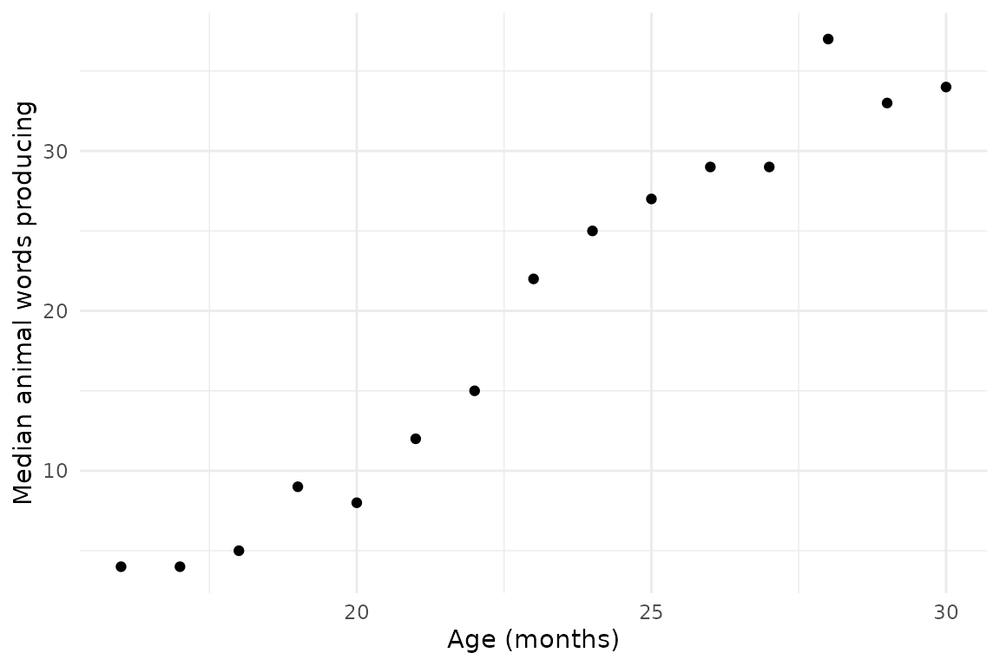

# Accessing the Wordbank database

The `wordbankr` package allows you to access data in the [Wordbank
database](http://wordbank.stanford.edu/) from `R`. This vignette shows
some examples of how to use the data loading functions and what the
resulting data look like.

There are three different data views that you can pull out of Wordbank:
by-administration, by-item, and administration-by-item. Additionally,
you can get metadata about the datasets and instruments underlying the
data. Advanced functionality let’s you get estimates of words’ age of
acquisition and word mappings across languages.

## Administrations

The
[`get_administration_data()`](http://langcog.github.io/wordbankr/reference/get_administration_data.md)
function gives by-administration information, either for a specific
language and/or form or for all instruments.

``` r
get_administration_data(language = "English (American)", form = "WS")
```

    ## # A tibble: 9,093 × 12
    ##    data_id date_of_test   age comprehension production is_norming dataset_name
    ##      <dbl> <chr>        <int>         <int>      <int> <lgl>      <chr>       
    ##  1  396587 2010-06-27      25           658        658 FALSE      Marchman    
    ##  2  396588 2010-07-08      26           552        552 FALSE      Marchman    
    ##  3  396589 2010-10-14      24           504        504 FALSE      Marchman    
    ##  4  396590 2010-08-18      26           272        272 FALSE      Marchman    
    ##  5  396591 2010-08-17      24           350        350 FALSE      Marchman    
    ##  6  396592 2010-05-25      25           580        580 FALSE      Marchman    
    ##  7  396593 2010-03-05      22           351        351 FALSE      Marchman    
    ##  8  396594 2010-03-03      24           310        310 FALSE      Marchman    
    ##  9  396595 2010-05-25      25           257        257 FALSE      Marchman    
    ## 10  396596 2010-07-21      26           188        188 FALSE      Marchman    
    ## # ℹ 9,083 more rows
    ## # ℹ 5 more variables: dataset_origin_name <chr>, language <chr>, form <chr>,
    ## #   form_type <chr>, child_id <int>

``` r
get_administration_data()
```

    ## # A tibble: 100,527 × 12
    ##    data_id date_of_test   age comprehension production is_norming dataset_name
    ##      <dbl> <chr>        <int>         <int>      <int> <lgl>      <chr>       
    ##  1  277770 NA              10            31         15 FALSE      Alroqi      
    ##  2  277771 NA              13            28         14 FALSE      Alroqi      
    ##  3  277772 NA              10            12          1 FALSE      Alroqi      
    ##  4  277773 NA              12           162         10 FALSE      Alroqi      
    ##  5  277774 NA              13            40         12 FALSE      Alroqi      
    ##  6  277775 NA              11            13          2 FALSE      Alroqi      
    ##  7  277776 NA               9             2          2 FALSE      Alroqi      
    ##  8  277777 NA              14            71         16 FALSE      Alroqi      
    ##  9  277778 NA              10            42          2 FALSE      Alroqi      
    ## 10  277780 NA              11            19          3 FALSE      Alroqi      
    ## # ℹ 100,517 more rows
    ## # ℹ 5 more variables: dataset_origin_name <chr>, language <chr>, form <chr>,
    ## #   form_type <chr>, child_id <int>

## Items

The
[`get_item_data()`](http://langcog.github.io/wordbankr/reference/get_item_data.md)
function gives by-item information, either for a specific language
and/or form or for all instruments.

``` r
get_item_data(language = "Italian", form = "WG")
```

    ## # A tibble: 505 × 11
    ##    item_id language form  form_type item_kind   category item_definition        
    ##    <chr>   <chr>    <chr> <chr>     <chr>       <chr>    <chr>                  
    ##  1 item_1  Italian  WG    WG        first_signs NA       Risponde quando è chia…
    ##  2 item_2  Italian  WG    WG        first_signs NA       Risponde ad un No      
    ##  3 item_3  Italian  WG    WG        first_signs NA       Reagisce ad un C'è la …
    ##  4 item_4  Italian  WG    WG        phrases     NA       Vuoi la pappa          
    ##  5 item_5  Italian  WG    WG        phrases     NA       Hai sonno? Sei stanco  
    ##  6 item_6  Italian  WG    WG        phrases     NA       Vuoi bere?             
    ##  7 item_7  Italian  WG    WG        phrases     NA       Stai attento           
    ##  8 item_8  Italian  WG    WG        phrases     NA       Stai buono             
    ##  9 item_9  Italian  WG    WG        phrases     NA       Batti le manine        
    ## 10 item_10 Italian  WG    WG        phrases     NA       Cambiamo il pannolino  
    ## # ℹ 495 more rows
    ## # ℹ 4 more variables: english_gloss <chr>, uni_lemma <chr>,
    ## #   lexical_category <chr>, complexity_category <chr>

``` r
get_item_data()
```

    ## # A tibble: 46,746 × 11
    ##    item_id language           form  form_type item_kind category item_definition
    ##    <chr>   <chr>              <chr> <chr>     <chr>     <chr>    <chr>          
    ##  1 item_1  British Sign Lang… WG    WG        phrases   NA       be careful     
    ##  2 item_2  British Sign Lang… WG    WG        phrases   NA       bring me       
    ##  3 item_3  British Sign Lang… WG    WG        phrases   NA       change nappy   
    ##  4 item_4  British Sign Lang… WG    WG        phrases   NA       come here      
    ##  5 item_5  British Sign Lang… WG    WG        phrases   NA       daddy/mummy ho…
    ##  6 item_6  British Sign Lang… WG    WG        phrases   NA       donttouch      
    ##  7 item_7  British Sign Lang… WG    WG        phrases   NA       finish         
    ##  8 item_8  British Sign Lang… WG    WG        phrases   NA       get up         
    ##  9 item_9  British Sign Lang… WG    WG        phrases   NA       give me hug    
    ## 10 item_10 British Sign Lang… WG    WG        phrases   NA       give me kiss   
    ## # ℹ 46,736 more rows
    ## # ℹ 4 more variables: english_gloss <chr>, uni_lemma <chr>,
    ## #   lexical_category <chr>, complexity_category <chr>

## Administrations x Items

If you are only looking at total vocabulary size, `admins` is all you
need, since it has both productive and receptive vocabulary sizes
calculated. If you are looking at specific items or subsets of items,
you need to load instrument data, using the
[`get_instrument_data()`](http://langcog.github.io/wordbankr/reference/get_instrument_data.md)
function. Pass it an instrument language and form, along with a list of
items you want to extract (by `item_id`).

``` r
get_instrument_data(
  language = "English (American)",
  form = "WS",
  items = c("item_26", "item_46")
)
```

    ## # A tibble: 20,296 × 5
    ##    data_id item_id value    produces understands
    ##      <dbl> <chr>   <chr>    <lgl>    <lgl>      
    ##  1  396587 item_26 produces TRUE     NA         
    ##  2  396588 item_26 produces TRUE     NA         
    ##  3  396589 item_26 produces TRUE     NA         
    ##  4  396590 item_26 produces TRUE     NA         
    ##  5  396591 item_26 produces TRUE     NA         
    ##  6  396592 item_26 produces TRUE     NA         
    ##  7  396593 item_26 produces TRUE     NA         
    ##  8  396594 item_26 produces TRUE     NA         
    ##  9  396595 item_26 produces TRUE     NA         
    ## 10  396596 item_26 produces TRUE     NA         
    ## # ℹ 20,286 more rows

By default
[`get_instrument_table()`](http://langcog.github.io/wordbankr/reference/get_instrument_table.md)
returns a data frame with columns of the administration’s `data_id`, the
item’s `num_item_id` (numerical `item_id`), and the corresponding value.
To include administration information, you can set the `administrations`
argument to `TRUE`, or pass the result of
[`get_administration_data()`](http://langcog.github.io/wordbankr/reference/get_administration_data.md)
as `administrations` (that way you can prevent the administration data
from being loaded multiple times). Similarly, you can set the `iteminfo`
argument to `TRUE`, or pass it result of
[`get_item_data()`](http://langcog.github.io/wordbankr/reference/get_item_data.md).

Loading the data is fast if you need only a handful of items, but the
time scales about linearly with the number of items, and can get quite
slow if you need many or all of them. So, it’s a good idea to filter
down to only the items you need before calling
[`get_instrument_data()`](http://langcog.github.io/wordbankr/reference/get_instrument_data.md).

As an example, let’s say we want to look at the production of animal
words on English Words & Sentences over age. First we get the items we
want:

``` r
items <- get_item_data(language = "English (American)", form = "WS")
if (!is.null(items)) {
  animals <- items %>% filter(category == "animals")
}
```

Then we get the instrument data for those items:

``` r
if (!is.null(animals)) {
  animal_data <- get_instrument_data(language = "English (American)",
                                     form = "WS",
                                     items = animals$item_id,
                                     administration_info = TRUE,
                                     item_info = TRUE)
}
```

Finally, we calculate how many animals words each child produces and the
median number of animals of each age bin:

``` r
if (!is.null(animal_data)) {
  animal_summary <- animal_data %>%
    group_by(age, data_id) %>%
    summarise(num_animals = sum(produces, na.rm = TRUE)) %>%
    group_by(age) %>%
    summarise(median_num_animals = median(num_animals, na.rm = TRUE))
  
  ggplot(animal_summary, aes(x = age, y = median_num_animals)) +
    geom_point() +
    labs(x = "Age (months)", y = "Median animal words producing")
}
```



## Metadata

### Instruments

The
[`get_instruments()`](http://langcog.github.io/wordbankr/reference/get_instruments.md)
function gives information on all the CDI instruments in Wordbank.

``` r
get_instruments()
```

    ## # A tibble: 89 × 8
    ##    instrument_id language            form  form_type age_min age_max has_grammar
    ##            <int> <chr>               <chr> <chr>       <int>   <int>       <int>
    ##  1             1 British Sign Langu… WG    WG              8      36           0
    ##  2             2 Cantonese           WS    WS             16      30           0
    ##  3             3 Croatian            WG    WG              8      16           0
    ##  4             4 Croatian            WS    WS             16      30           0
    ##  5             5 Danish              WG    WG              8      20           0
    ##  6             6 Danish              WS    WS             16      36           1
    ##  7             7 English (American)  WG    WG              8      18           0
    ##  8             8 English (American)  WS    WS             16      30           1
    ##  9             9 French (Quebecois)  WG    WG              8      16           0
    ## 10            10 French (Quebecois)  WS    WS             16      30           1
    ## # ℹ 79 more rows
    ## # ℹ 1 more variable: unilemma_coverage <dbl>

### Datasets

The
[`get_datasets()`](http://langcog.github.io/wordbankr/reference/get_datasets.md)
function gives information on all the datasets in Wordbank, either for a
specific language and/or form or for all instruments. If the
`admin_data` argument is set to `TRUE`, the results will also include
the number of administrations in the database from that dataset.

``` r
get_datasets(form = "WG")
```

    ## # A tibble: 44 × 15
    ##    dataset_id dataset_name  dataset_origin_name     contributor citation license
    ##         <int> <chr>         <chr>                   <chr>       <chr>    <chr>  
    ##  1          5 Marchman      Marchman_Norming_Engli… Larry Fens… "Fenson… CC-BY  
    ##  2          6 Byers         Byers__English (Americ… Krista Bye… ""       CC-BY  
    ##  3          7 Thal          Thal                    Donna Thal… "Thal, … CC-BY  
    ##  4          9 Marchman      Marchman_Norming_Spani… Donna Jack… "Jackso… CC-BY  
    ##  5         12 Kristoffersen Kristoffersen_longitud… Hanne Simo… "Simons… CC-BY  
    ##  6         13 CLEX          CLEX__Croatian_WG       Melita Kov… "Kovace… CC-BY  
    ##  7         17 CLEX          CLEX__Russian_WG        Stella Cey… "Е.А.Ве… CC-BY  
    ##  8         19 CLEX          CLEX__Swedish_WG        Mårten Eri… "Erikss… CC-BY  
    ##  9         21 CLEX          CLEX__Turkish_WG        Aylin Künt… "Acarla… CC-BY  
    ## 10         23 Shalev        Shalev__Hebrew_WG       Hila Gendl… "Gendle… CC-BY  
    ## # ℹ 34 more rows
    ## # ℹ 9 more variables: longitudinal <lgl>, source <chr>, date_format <chr>,
    ## #   file_location <chr>, norming <chr>, splitcol <chr>, language <chr>,
    ## #   form <chr>, form_type <chr>

``` r
get_datasets(language = "Spanish (Mexican)", admin_data = TRUE)
```

    ## # A tibble: 7 × 16
    ##   dataset_id dataset_name dataset_origin_name       contributor citation license
    ##        <int> <chr>        <chr>                     <chr>       <chr>    <chr>  
    ## 1          8 Marchman     Marchman Dallas Bilingual Donna Jack… Marchma… CC-BY  
    ## 2          9 Marchman     Marchman_Norming_Spanish… Donna Jack… Jackson… CC-BY  
    ## 3         55 Fernald      Fernald_Outreach_Spanish… Anne Ferna… ​Weisle…  CC-BY  
    ## 4         56 Fernald      Fernald_Outreach_Spanish… Anne Ferna… ​Weisle…  CC-BY  
    ## 5         76 Marchman     Marchman_Norming_Spanish… Donna Jack… Jackson… CC-BY  
    ## 6         87 Hoff         Hoff_English_Mexican_Bil… Erika Hoff… Hoff, E… CC-BY  
    ## 7        135 Hoff         Hoff_English_Mexican_Bil… Erika Hoff… Hoff, E… CC-BY  
    ## # ℹ 10 more variables: longitudinal <lgl>, source <chr>, date_format <chr>,
    ## #   file_location <chr>, norming <chr>, splitcol <chr>, language <chr>,
    ## #   form <chr>, form_type <chr>, n_admins <dbl>

## Advanced functionality: Age of acquisition

The
[`fit_aoa()`](http://langcog.github.io/wordbankr/reference/fit_aoa.md)
function computes estimates of items’ age of acquisition (AoA). It needs
to be provided with a data frame returned by
[`get_instrument_data()`](http://langcog.github.io/wordbankr/reference/get_instrument_data.md)
– one row per administration x item combination, and minimally the
columns `age` and `num_item_id`. It returns a data frame with one row
per item and an `aoa` column with the estimate, preserving and
item-level columns in the input data. The AoA is estimated by computing
the proportion of administrations for which the child
understands/produces (`measure`) each word, smoothing the proportion
using `method`, and taking the age at which the smoothed value is
greater than `proportion`.

``` r
fit_aoa(animal_data)
```

    ## # A tibble: 43 × 8
    ##      aoa item_id item_kind item_definition category lexical_category uni_lemma
    ##    <dbl> <chr>   <chr>     <chr>           <chr>    <chr>            <chr>    
    ##  1    26 item_13 word      alligator       animals  nouns            alligator
    ##  2    25 item_14 word      animal          animals  nouns            animal   
    ##  3    26 item_15 word      ant             animals  nouns            ant      
    ##  4    20 item_16 word      bear            animals  nouns            bear     
    ##  5    22 item_17 word      bee             animals  nouns            bee      
    ##  6    18 item_18 word      bird            animals  nouns            bird     
    ##  7    23 item_19 word      bug             animals  nouns            bug      
    ##  8    22 item_20 word      bunny           animals  nouns            bunny    
    ##  9    24 item_21 word      butterfly       animals  nouns            butterfly
    ## 10    18 item_22 word      cat             animals  nouns            cat      
    ## # ℹ 33 more rows
    ## # ℹ 1 more variable: complexity_category <chr>

``` r
fit_aoa(animal_data, method = "glmrob", proportion = 1/3)
```

    ## # A tibble: 43 × 8
    ##      aoa item_id item_kind item_definition category lexical_category uni_lemma
    ##    <dbl> <chr>   <chr>     <chr>           <chr>    <chr>            <chr>    
    ##  1    24 item_13 word      alligator       animals  nouns            alligator
    ##  2    23 item_14 word      animal          animals  nouns            animal   
    ##  3    23 item_15 word      ant             animals  nouns            ant      
    ##  4    18 item_16 word      bear            animals  nouns            bear     
    ##  5    20 item_17 word      bee             animals  nouns            bee      
    ##  6    NA item_18 word      bird            animals  nouns            bird     
    ##  7    21 item_19 word      bug             animals  nouns            bug      
    ##  8    19 item_20 word      bunny           animals  nouns            bunny    
    ##  9    22 item_21 word      butterfly       animals  nouns            butterfly
    ## 10    NA item_22 word      cat             animals  nouns            cat      
    ## # ℹ 33 more rows
    ## # ℹ 1 more variable: complexity_category <chr>

## Advanced functionality: Cross-linguistic data

One of the item-level fields is `uni_lemma` (“universal lemma”), which
is intended to be an approximate semantic mapping between words across
the languages in Wordbank. The function
[`get_crossling_items()`](http://langcog.github.io/wordbankr/reference/get_crossling_items.md)
simply gives all the available `uni_lemma` values.

``` r
get_crossling_items()
```

    ## # A tibble: 2,570 × 2
    ##       id uni_lemma                
    ##    <int> <chr>                    
    ##  1  1739 (hair)brush              
    ##  2  1552 (play)pen                
    ##  3  1494 (sheep)                  
    ##  4  1783 (to be in) pain          
    ##  5  1777 (to be) hungry           
    ##  6  1775 (to be) thirsty          
    ##  7  1769 (to have) breakfast      
    ##  8  1272 [possessive]             
    ##  9  1593 [to splash in the water?]
    ## 10  1951 1PL                      
    ## # ℹ 2,560 more rows

The function
[`get_crossling_data()`](http://langcog.github.io/wordbankr/reference/get_crossling_data.md)
takes a vector of `uni_lemmas` and returns a data frame of summary
statistics for each item mapped to that uni_lemma in any language (on
`WG` forms). Each row is combination of item and age, and the columns
indicate the number of children (`n_children`), means (`comprehension`,
`production`), standard deviations (`comprehension_sd`,
`production_sd`), and item-level fields.

``` r
get_crossling_data(uni_lemmas = c("hat", "nose")) %>%
  select(language, uni_lemma, item_definition, age, n_children, comprehension,
         production, comprehension_sd, production_sd) %>%
  arrange(uni_lemma)
```
